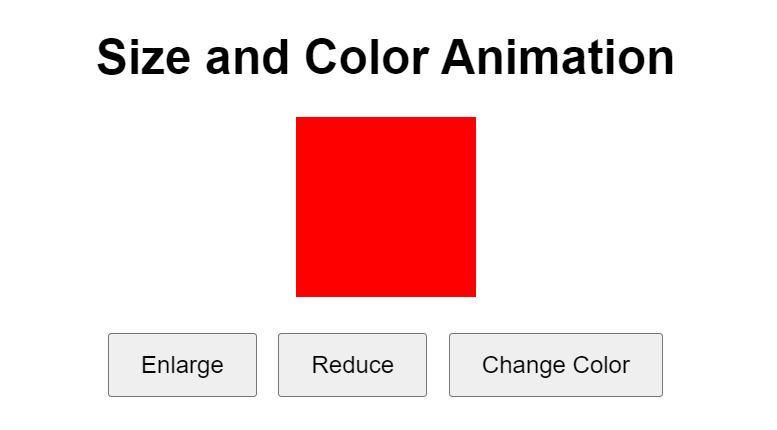

# Size-and-Color-Animation-with-jQuery

## Description
This web page features a simple interactive animation that allows users to change the size and color of a square using jQuery. The page includes a square div element and three buttons for controlling the animation: enlarging, reducing, and changing color.

### Components:

1. **HTML Structure**:
    - **Heading**: A header (`<h1>`) titled "Size and Color Animation".
    - **Square Div**: A div (`
`) with the ID `#square` which will be animated.
    - **Buttons**: Three buttons labeled "Enlarge", "Reduce", and "Change Color".

2. **CSS Styling**:
    - The page uses a clean, centered design with a specific width, height, and background color for the square.
    - Buttons are styled for visual clarity and easy interaction with padding and margins.

3. **JavaScript (jQuery)**:
    - **Document Ready**: Ensures the jQuery code runs only after the document is fully loaded.
    - **Button Click Events**: 
        - "Enlarge" button increases the width and height of the square by 20px over 2 seconds.
        - "Reduce" button decreases the width and height of the square by 20px over 2 seconds.
        - "Change Color" button cycles through red, green, and yellow colors for the square's background.

### Features:
- **Interactive Size Animation**: Users can click buttons to dynamically increase or decrease the size of the square.
- **Dynamic Color Change**: Users can cycle through different background colors for the square.
- **Smooth Transitions**: Size changes are animated smoothly over a duration of 2 seconds.

### Usage:
- **Enlarge Button**: Click to increase the size of the square.
- **Reduce Button**: Click to decrease the size of the square.
- **Change Color Button**: Click to cycle through red, green, and yellow background colors.

This example provides a straightforward and engaging way to demonstrate basic jQuery animations and dynamic style changes on a web page.
